<style>
toc {
text-align: left
}
h1, h2, h3 {
text-align: left
}
body {
text-align: justify}
</style>

```{r setup, include=FALSE}
knitr::opts_chunk$set(echo = FALSE)
```

## Overview

The original visualisation is as shown below:

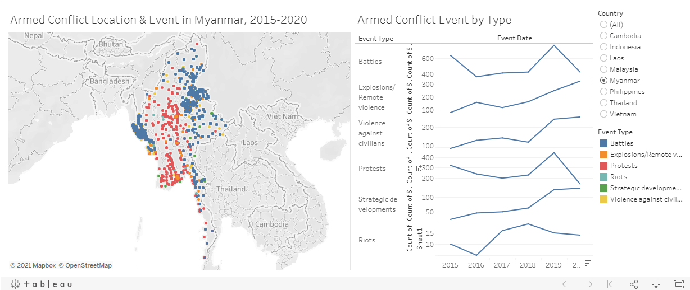{width=100%}

  
## A. Critiques

### Clarity

1. The y-axis titles of the line plots under Armed Conflict Event by Type of different event types are named as "Count of Sheet1". It is unclear to the reader as to what is "Sheet1". 
1. The list of event types consists of "Strategic developments". This is confusing as "Strategic developments" is not a negative events, unlike the others.
1. Data source is not added. The credibility of the visualisation is questionable.
1. The data range used differ across countries. For example, the line graphs of Malaysia show only 2018 to 2020 information. This can be misleading as the title of the map continues to show "2015-2020".
1. There are different shapes observed for the same event type/ color. It is unclear what the different shapes represent since there is no legend provided.

### Aesthetics

1. With reference to the Armed Conflict Location & Event visualisation on the right, several countries have high concentration of events points with certain events overlapping the others. Readers are not able to easily identify the other events in the same area. Examples of places or spots with high concentration of events include the whole of the Philippines, northern part of Rakhine State of Myanmar, and Pattani, Yala, and Narathiwat provinces at the southernmost of Thailand.
1. The header of the line plots should not be "Event Date" as the default x-axis shows only the years.
1. The word "Event" on the title of the map does not change when a specific Event Type is selected. 
1. The data points on the map have white borders that are redundant.

### Interactivity

1. Country filter is provided to allow users to focus on country of their interest.
1. Event Type filter highlights the corresponding line graph and points on the map by lightening the colours of the non-selected ones. This enables users to quickly identify the graph and event they would like to focus on.
1. The hover-over information/ tooltip of the individual points on the map does not provide much useful information.

## B. Proposed Improvement and Data Visualisation

### Clarity

1. The y-asix title of the line graph should be amended from "Count of Sheet1" to "Number of Events".
1. Include the data source used for the visualisation.
1. The tooltip of the filled map should have irrelevant information removed and with useful information added.
1. The tooltip of the symbol map should include other information such as sub event type and notes for each event point.

### Aesthetics

1. Align the x and y-axis of all the line plots of different event types.
1. Merge all the events into one single filled graph so that users could compare the severity or frequency of different events within the same country.
1. The filled map is to be coloured by the same colour of different gradient to show the difference in the number of armed conflicts.
1. Place a symbol map beside the filled map to show a similar visualisation with points coloured by event type and sized by number of fatalities.
1. For the symbol map, the points are to have slight transparency so have to reveal the "hidden" event points overlapped by others

### Interactivity

1. When a country is selected on a filled map, the view should be zoomed in to focused on the country only. The corresponding symbol map should also be focusing on the country selected.
1. The tooltip should showed more information provided in the dataset, as mentioned under Clarity. It shoudl have table of data if necessary.
1. The titles of the visualisations should be updated interactively as users make changes to the filters.

### Proposed Data Visualisation

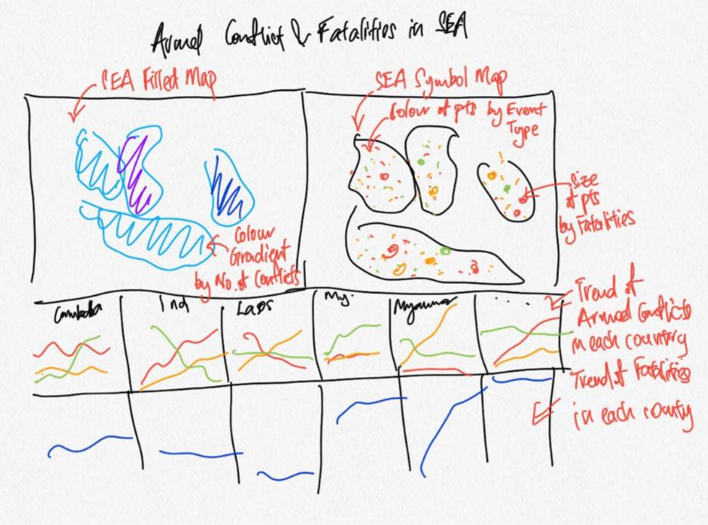{width=100%}

## C. Data Visualisation in Tableau

The interactive dashboard created could be found [here](https://public.tableau.com/profile/dylan7338#!/vizhome/DataVizMakeover3_16163282156450/Dashboard2)

  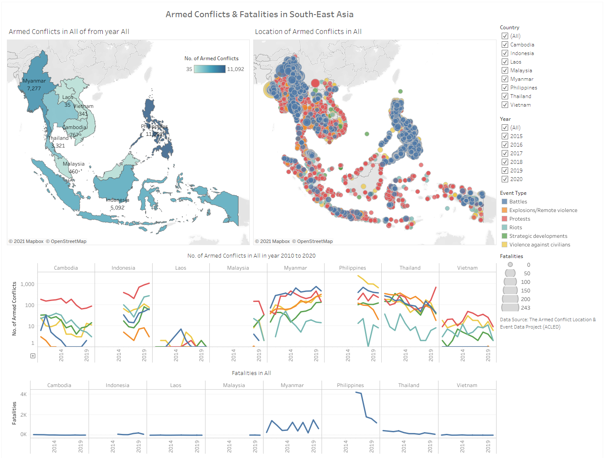{width=100%}

## D. Preparation of Data Visualisation

### 1. Loading and Preparation of Data

* After loading up Tableau Desktop, select Microsoft Excel, and locate the data file.

  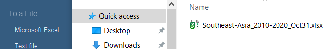

* On the preview panel, review the data to make sure that the variables are of the correct data type. Since the variable *Year* will be used for the visualisation, and it is of the wrong data type by default, click on the hash (#) symbol above the column header, which represents Number, and select Date.

  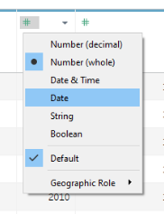

### 2. Creating Filled Map

* On a new worksheet, rename Filled Map, drag *Latitude* to Rows and *Longitude* to Columns.

  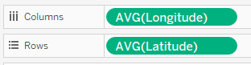

* Create a new variable by selecting **Create Calculated Field...** from the drop down arrow.

  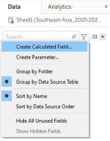
  
* Name the variable appropriate and input "1" in the formula field.
  
  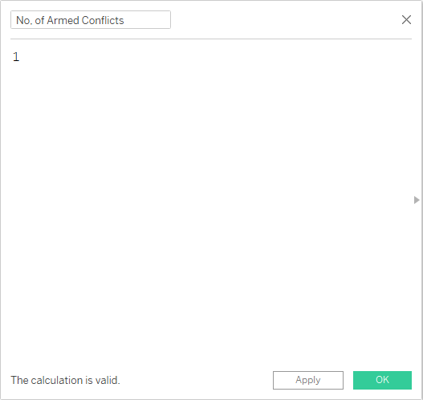

* The default map generated has Country Names shown. Since the focus is on South-East Asia, and that fill colour will overlap and names, there is no point have the Count Names layer turned on. To remove, select **Map > Map Layers** on the menu bar then uncheck Country/Region Names.

  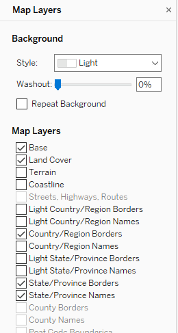
  
* Drag *No. of Armed Conflicts* to Colour, *Country* to Detail, *Country* again to Label, *No. of Armed Conflicts* to Label, and *Fatalities* to Detail. Change the display to Map from the drop-down.

  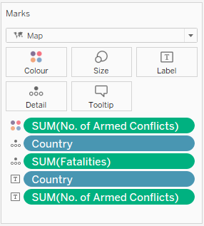

* From the preview of the data earlier, it was observed that the variable *Year* consists of years 2010 to 2020. To limit the filter range to just 2015 to 2020, drag *Year* to Filters. Select Years and then check 2015 to 2020.
  
  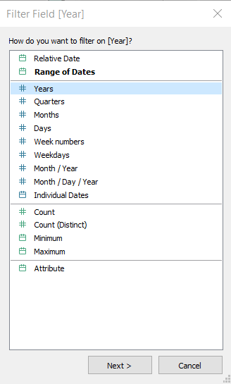

  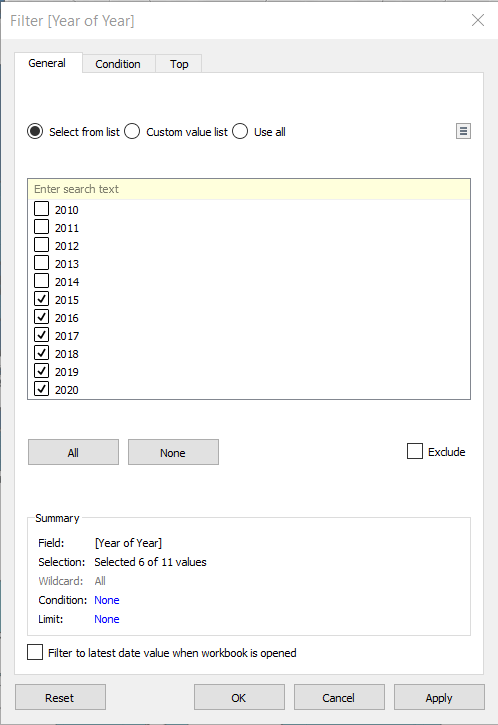

* Right-click on same *Year* on the data panel and select duplicate.

  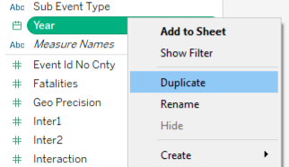
  
* Drag the duplicated *Year (copy)* to filters, and repear the same selections as above.

  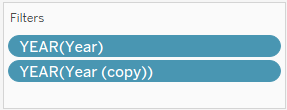
  
* To display the filter, right-click on *YEAR(Year)* on Filters and select **Show Filter**.

  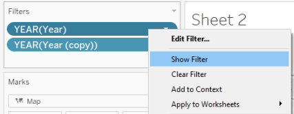

* On the drop-down menu of the *YEAR(Year)* shown, select **Only Relevant Values**.

  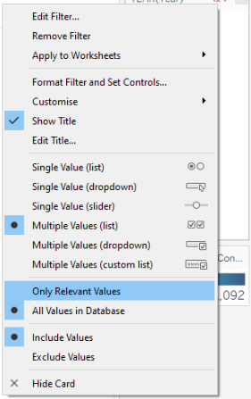

* Similar, to display the filter for *country*, drag the *Country* variable into the Filters panel, then right-click and select Show Filter.

  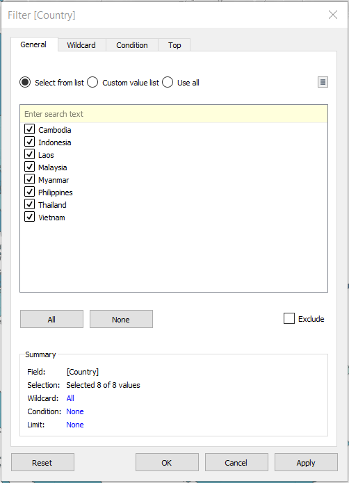

* To have the map zoomed into a particular country when selected, hold down Ctrl+Shift+A on the keyboard to open up the Actions window. Select **Add Action > Filter**.

  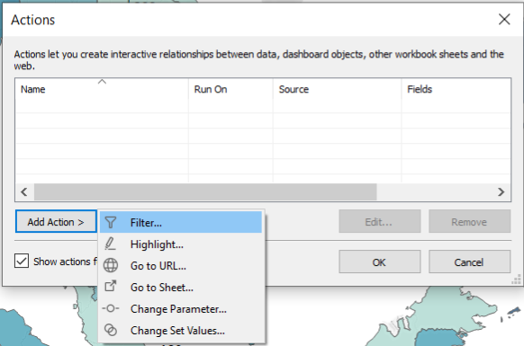

* On the Add Filter Action Window, select **Select** under "Run action on:". Under Target Filters, click on the **Add Filter...** button.

  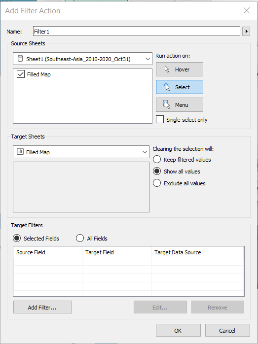
  
* On the drop-down menu of Data Source, select **Country**. Once down, click on OK, OK on the Add Filter Action window, and OK on the Actions window.

  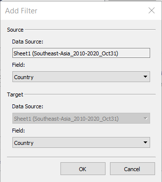

* Double-click on the chart title and edit it as shown. 
  
  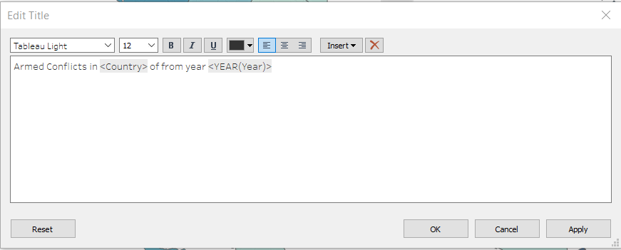{width=100%}

### 3. Creating and Editting Tooltip for Filled Map

* On a new sheet, renamed Event Occurrence, drag the variables *Event Type*, *Sub Event Type*, and *Event Type* again onto Rows.

  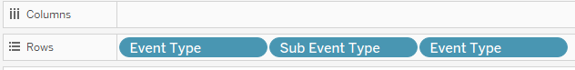
  
* Right-click on the last *Event Type*, select **Measure > Count**.

  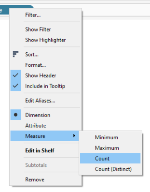 
   
* Drag the *CNT(Event Type)* to Text in the Marks panel.   
   
  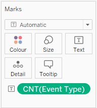 
   
* Back to the Filled Map sheet, select **Worksheet** on the menu bar, then **Tooltip...**.

  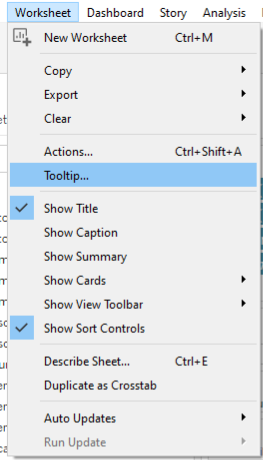 

* In the Edit Tooltip window, remove the irrelevant information and update the fields as shown.

  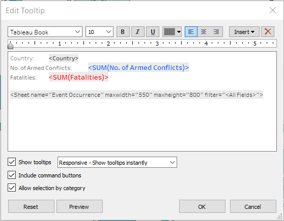 

### 4. Creating Symbol Map

* On a new sheet, renamed "Symbol Map", similar to the Filled Map, drag *Longitude* into Columns and *Latitude* into Rows.

  

* Drag *Event Type* into Colour, *Fatalities* into Size, *Event Id Cnty*, *Country*, *Sub Event Type*, and *Notes* into Detail.

  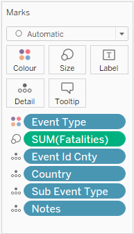

* Under Colour, reduce the Opacity to 75% and select grey colour a Border.

  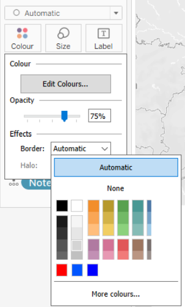 

* Click on the drop down arrow on *SUM(Fatalities)* on the right panel, and select **Edit sizes...*. Here, increase the size of the points by dragging the slider bar to the right.

  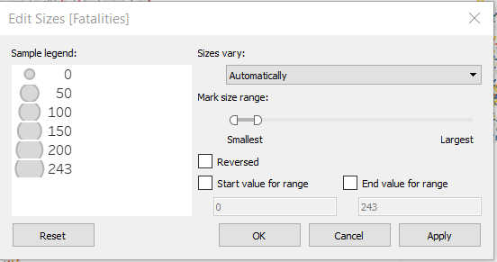 

* Ctrl+Shift+A > **Add Action > Filter** again. Similar to the previous action, select **Select** under "Run action on:", and add *Country* as the selected field.

  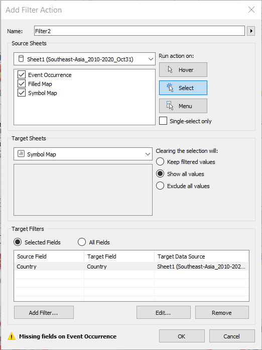 
  
* Edit the tooltip as shown.

  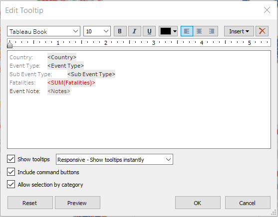

* Double-click on the chart title and edit it as shown. 
  
  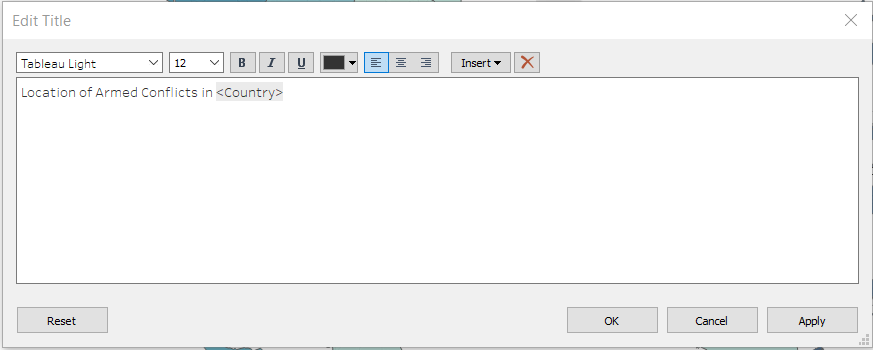{width=100%}

### 5. Creating Line Graphs for Number of Armed Conflicts

* On a new sheet, renamed "Conflicts", drag *Country* and *Year* to Columns and *No. of Armed Conflicts* to Rows.
  
  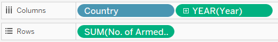 
  
* Drag *Event Type* to Colour.

  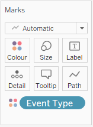 
  
* Right-click on the y-axis and select **Edit Axis...**.

  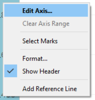 
  
* Under Scale, check **Logarithmic** then close the window.
  
  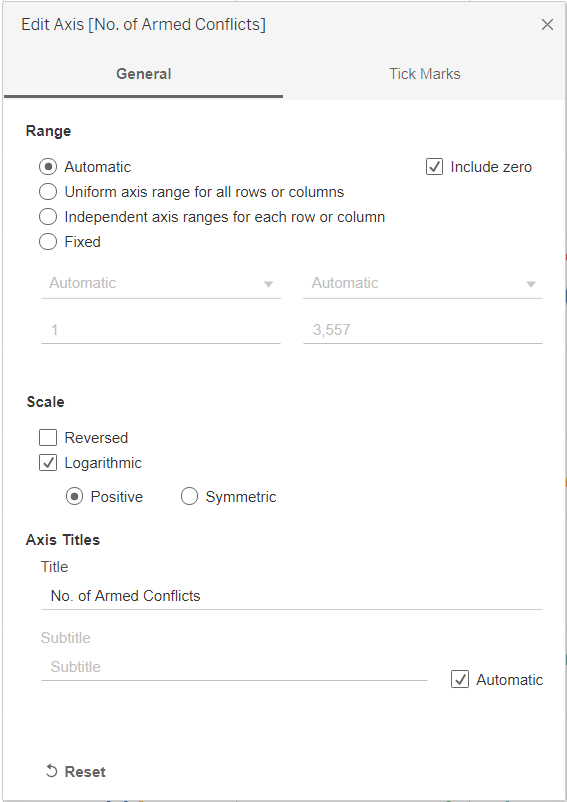 
  
* Double-click on the chart title and edit it as shown. 
  
  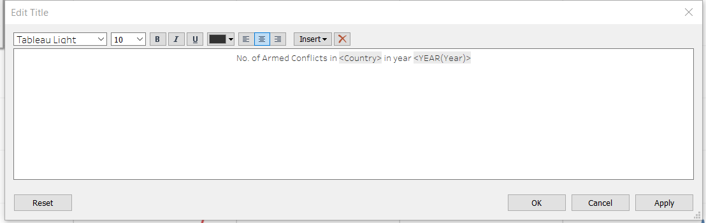{width=100%}
  
### 6. Creating Line Graphs for Fatalities

* On a new sheet, renamed "Fatalities", drag *Country* and *Year* to Columns and *Fatalities* to Rows.
  
  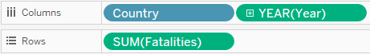
  
* Double-click on the chart title and edit it as shown. 
  
  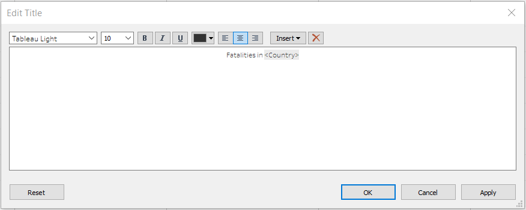{width=100%}

### Creating the Dashboard

* First, drag the Symbol Map to the dashboard. Next, place Conflicts below Symbol Map and Fatalities below Conflicts. Finally, drag in Filled Map on the left of Symbol Map.

  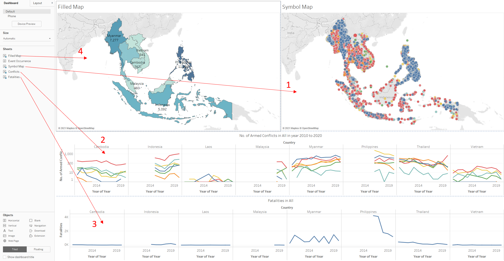{width=100%}
  
* Right-click on each of the filters, select **Apply to Worksheets > All Using Related Data Sources**.
  
  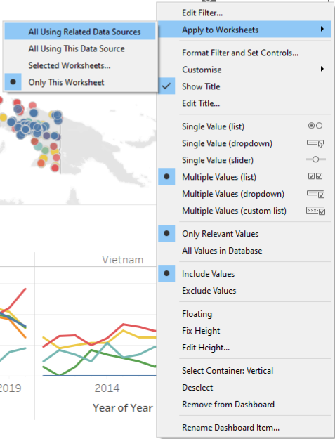 
  
* To better enable users to refer to the colour gradient of the Filled Map, right-click on the *No. of Armed Conflicts* color gradient bar and select **Floating**. Then, drag it to within the Filled Map area.

  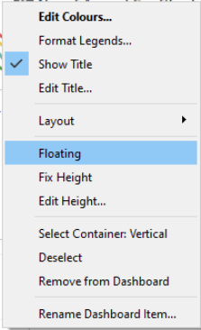 
  
* From the Objects panel, drag a Text to the top of the dashboard.

  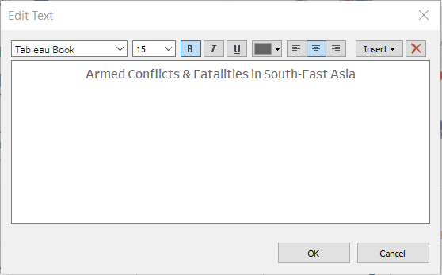

## E. Observations

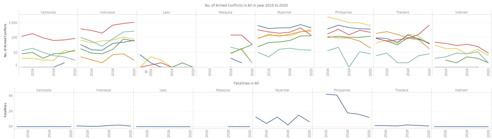{width=100%}

1. In the past 6 years, from 2015 to 2020, with the exception of Indonesia, Philipiines, and Thailand, the number of armed conflicts in the region stayed pretty much constant in general with no improvement or escalation. Both Indonesia and Thailand saw a stark increase in the number of Protests, while the Philippines saw a dip in the number of Violence against civilians.
2. With the exception of Myanmar and the Philippines, most of the countries in the region had low fatalities despite multiple armed conflicts of different types.

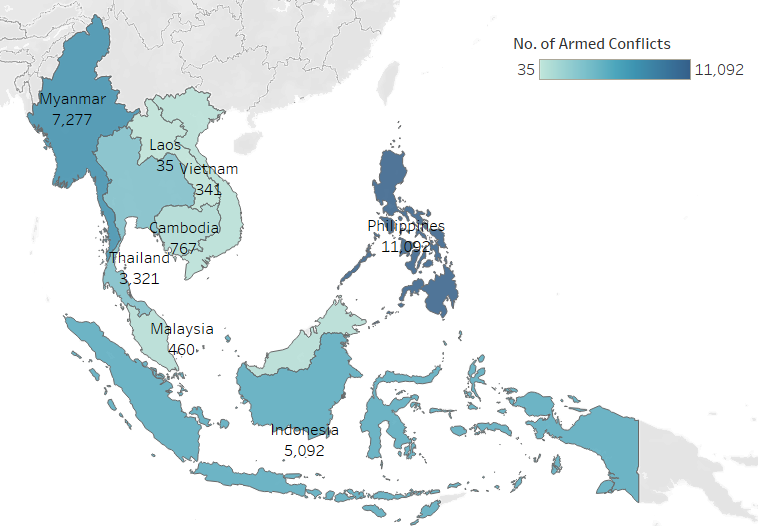{width=100%}

3. From the colour gradient and the hover-over information, it could be observed that the Philippines has the most number of conflicts in the last 6 years, followed by Myanmar, Indonesia, Thailand, Cambodia, Malaysia, Vietnam, and Laos.

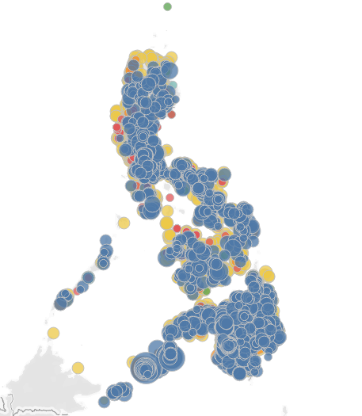{width=100%}

4. Zooming in on the Philippines by selecting the filled map on the left, and then observing the points on the symbol map on the right, it could be observed from the size of the points that while the country has more Violence against civilians than Battles, it has relatively lower fatalities per event than Battles.

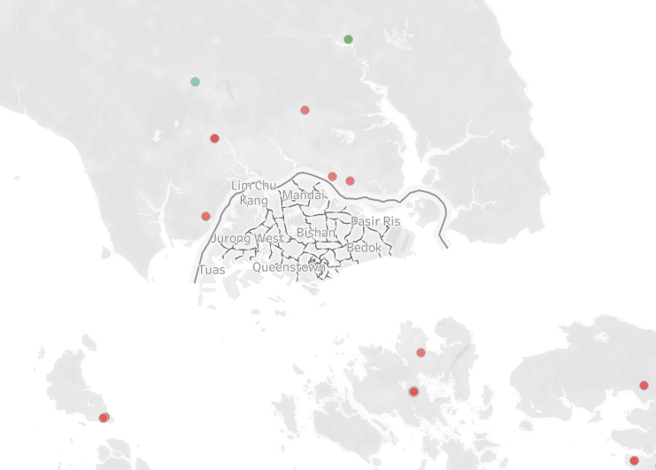{width=100%}

5. The area of the neighboring countries surrounding Singapore are rather peaceful in the past 6 years. A small number of Protests broke up but were of little to no fatality.


Distill is a publication format for scientific and technical writing, native to the web.

Learn more about using Distill at <https://rstudio.github.io/distill>.


